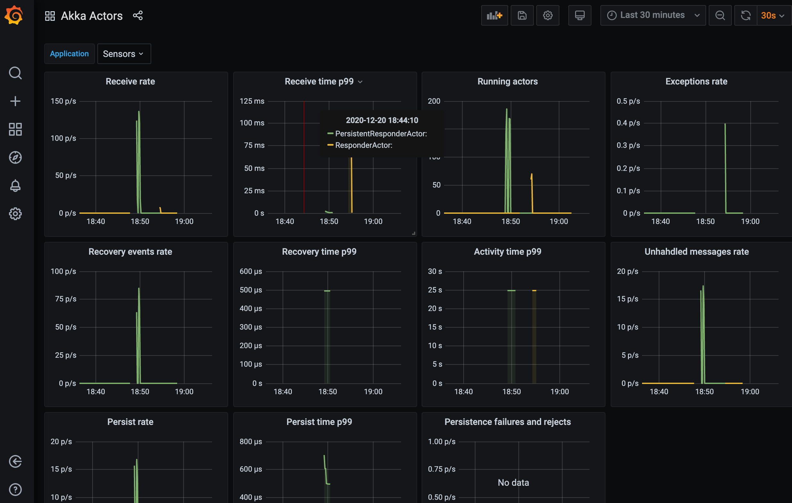
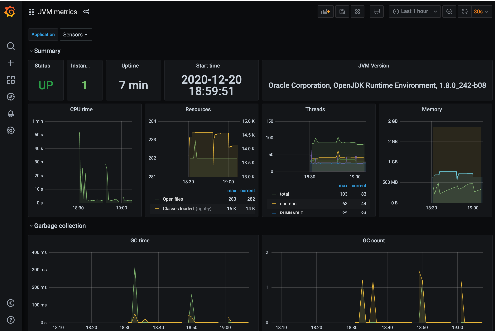
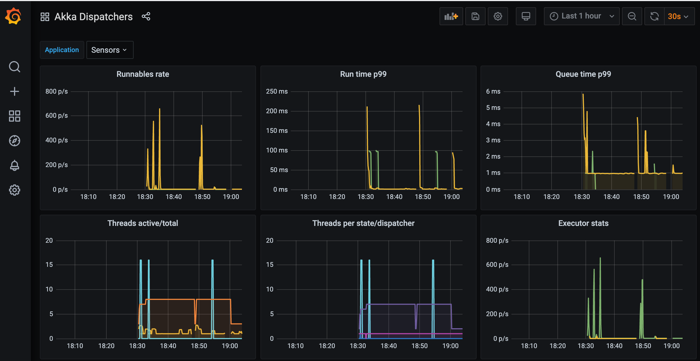
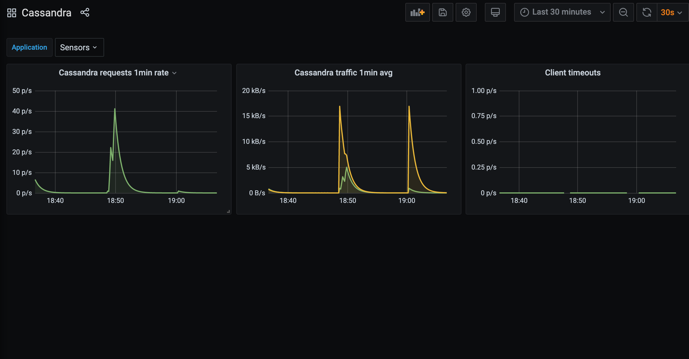

# Minimalist Akka Observability
[](https://dev.azure.com/pragmasoftnl/akka-sensors/_build/latest?definitionId=30)
[](https://codecov.io/gh/jacum/akka-sensors?branch=master)
[](https://scala-steward.org)


**Non-intrusive native Prometheus collectors for Akka internals, negligible performance overhead, suitable for production use.**

- Are you running (or about to run) Akka in production, full-throttle, and want to see what happens inside?  Did your load tests produce some ask timeouts? thread starvation? threads behaving non-reactively? old code doing nasty blocking I/O? 

- Would be nice to use Cinnamon Telemetry, but LightBend subscription is out of reach? 

- Overhead created by Kamon doesn't look acceptable, especially when running full-throttle?

- Already familiar with Prometheus/Grafana observability stack?

If you answer 'yes' to most of the questions above, Akka Sensors may be the right choice for you:

- Comprehensive feature set to make internals of your Akka visible, in any environment, including high-load production. 

- It is OSS/free, as in MIT license, and uses explicit, very lightweight instrumentation - yet is a treasure trove for a busy observability engineer.

- Won't affect CPU costs, when running in public cloud.

- Easy Demo/Evaluation setup included: Akka with Cassandra persistence, Prometheus server and Grafana dashboards.

|
--- | ---
|

## Features

### Java Virtual Machine 
 - number of instances
 - start since / uptime
 - JVM version
 - memory pools
 - garbage collector

### Thread watcher
 - thread watcher, keeping eye on threads running suspiciously long, and reporting their stacktraces - to help you find blocking code quickly 

###  Dispatchers
 - time of runnable waiting in queue (histogram) 
 - time of runnable run (histogram)
 - implementation-specific ForkJoinPool and ThreadPool stats (gauges)
 - thread states, as seen from JMX ThreadInfo (histogram, updated once in X seconds) 
 - active worker threads (histogram, updated on each runnable)

### Basic actor stats
 - number of actors (gauge)
 - time of actor 'receive' run (histogram)
 - actor activity time (histogram)
 - unhandled messages (count)
 - exceptions (count)
 
### Persistent actor stats
 - recovery time (histogram)
 - number of recovery events (histogram)
 - persist time (histogram)
 - recovery failures (counter)
 - persist failures (counter)

### Cluster
 - cluster events, per type (counter)

### Cassandra
Instrumented Cassandra session provider, exposing Cassandra client metrics collection.
 - requests
 - traffic in/out
 - timeouts

## Demo setup

We assuming you have `docker` and `docker-compose` up and running.

Prepare sample app:
```
sbt "compile; project app; docker:publishLocal"
```

Start observability stack:
```
docker-compose -f observability/docker-compose.yml up
```

Send some events:
```
for z in {1..100}; do curl -X POST http://localhost:8080/api/ping-fj/$z/100; done
for z in {101..200}; do curl -X POST http://localhost:8080/api/ping-tp/$z/100; done
for z in {3001..3300}; do curl -X POST http://localhost:8080/api/ping-persistence/$z/300 ; done
```

Open Grafana at http://localhost:3000.

Go to http://localhost:3000/plugins/sensors-prometheus-app, click *Enable*.
Sensors' bundled dashboards will be imported.
 
 
## Usage

### SBT dependency

```
libraryDependencies ++= 
  Seq(
     "nl.pragmasoft.sensors" %% "sensors-core" % "0.0.2",
     "nl.pragmasoft.sensors" %% "sensors-cassandra" % "0.0.2"
  )
```

### Prometheus exporter

If you already have Prometheus exporter in your application, `CollectorRegistry.defaultRegistry` will be used by Sensors and the metrics should appear automatically.

For an example of HTTP exporter service, check `MetricService` implementation in example application (`app`) module. 

### Application configuration

Override `type` and `executor` with Sensors' instrumented executors.
Add `akka.sensors.AkkaSensorsExtension` to extensions.

```
akka {

  actor {

    # main/global/default dispatcher

    default-dispatcher {
      type = "akka.sensors.dispatch.InstrumentedDispatcherConfigurator"
      executor = "akka.sensors.dispatch.InstrumentedExecutor"

      instrumented-executor {
        delegate = "fork-join-executor" 
        measure-runs = true
        watch-long-runs = true
        watch-check-interval = 1s
        watch-too-long-run = 3s
      }
    }

    # some other dispatcher used in your app

    default-blocking-io-dispatcher {
      type = "akka.sensors.dispatch.InstrumentedDispatcherConfigurator"
      executor = "akka.sensors.dispatch.InstrumentedExecutor"

      instrumented-executor {
        delegate = "thread-pool-executor"
        measure-runs = true
        watch-long-runs = false
      }
    }
  }

  extensions = [
    akka.sensors.AkkaSensorsExtension
  ]
}

```

### Actors

```
 # Non-persistent actors
 class MyImportantActor extends Actor with ActorMetrics {

    # This becomes label 'actor', default is simple class name
    # but you may segment it further
    # Just make sure the cardinality is sane (<100)
    override protected def actorTag: String = ... 

      ... # your implementation
  }

 # Persistent actors
 class MyImportantPersistentActor extends Actor with PersistentActorMetrics {
  ...


```

### Additional metrics

For anything additional to measure in actors, extend `*ActorMetrics` in your own trait.

```
trait CustomActorMetrics extends ActorMetrics  with MetricsBuilders {

  val importantEvents: Counter = counter
    .name("important_events_total")
    .help(s"Important events")
    .labelNames("actor")
    .register(metrics.registry)

}

```

### Why codahale is used alongside Prometheus?

We would prefer 100% Prometheus, however Cassandra Datastax OSS driver doesn't support Prometheus collectors.
Prometheus is our preferred main metrics engine, hence we brigde metrics from Codahale via JMX.
This won't be needed anymore if Prometheus would be supported natively by Datastax driver.
